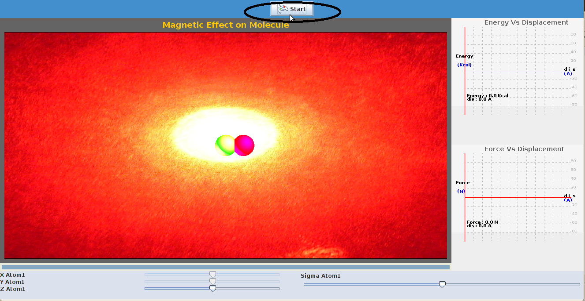
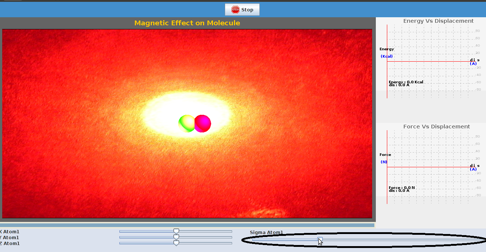
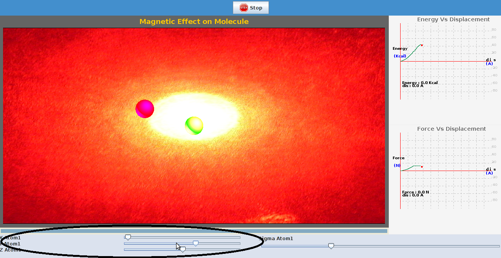

To perform this experiment there are certain parameters to be initialized and the procedure detailed here can be followed.

Step1:Click on "start" tab to start the experiment

Step2: Select a suitable value of the spring constant using the sliders provided on the display menu.

Step3: Change the position of the bead by varying the x,y,z coordinates using the sliders provided. A plot of force as function of distance is seen on right side.

