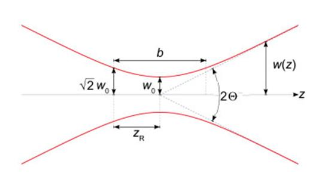

The narrowest point of the focused beam, known as the beam waist, contains a very strong electric field gradient. It turns out that dielectric particles are attracted along the gradient to the region of strongest electric field, which is the center of the beam. The laser light also tends to apply a force on particles in the beam along the direction of beam propagation. It is easy to understand why if one considers light to be a group of particles, each impinging on the tiny dielectric particle in its path. This is known as the scattering force and results in the particle being displaced slightly downstream from the exact position of the beam waist. Most optical traps operate with a Gaussian beam (TEM00 mode) profile intensity. In this case, if the particle is displaced from the center of the beam, it would experience a net force towards the center of the trap. This is because of the fact that more intense beams impart a larger momentum change towards the center of the trap than less intense beams, which impart a smaller momentum change away from the trap center. The net momentum change, or force, returns the particle to the trap center. For a Gaussian beam, the complex electric field amplitude is given by

E(r,z)=E0 ω0/ω(z) * exp(r2/ω2(z)) *exp(-ikz-ikR2/2R(z)+iς(z))

r=is the radial distance from the center axis of the beam

z = the axial distance from the beam's narrowest point (the "waist")

k=2π/λ is the wave number

E0=|E(0,0)|

ω(z) is the radius at which the field amplitude and intensity drop to 1/e and 1/e2 of their axial values

ω=ω0 is the waist size

R(z) = the radius of curvature of the beam's wavefronts

ς(z) = Gouy phase shift

                    